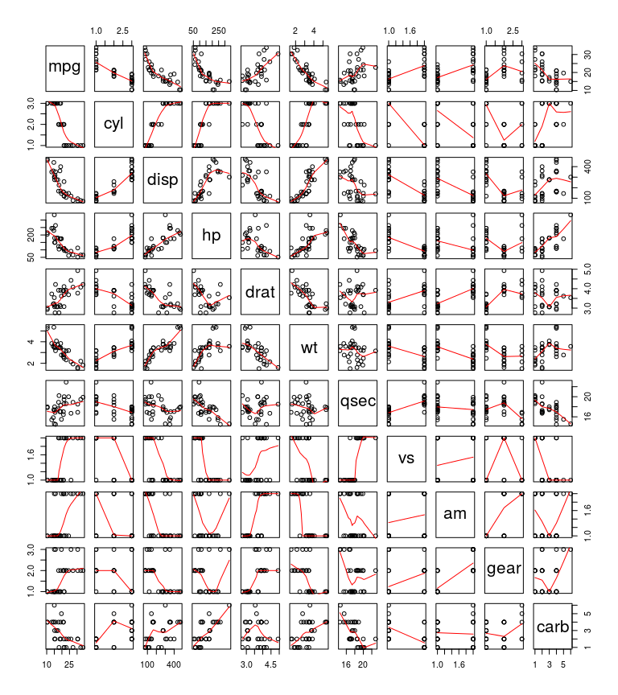
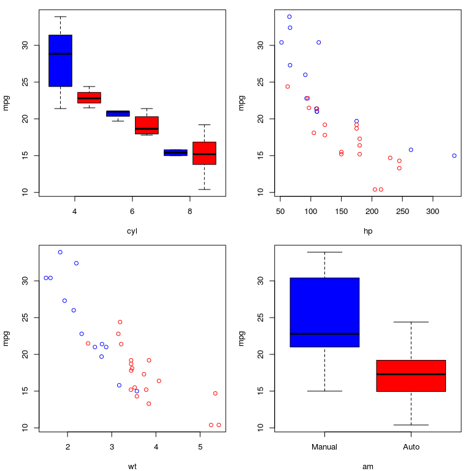
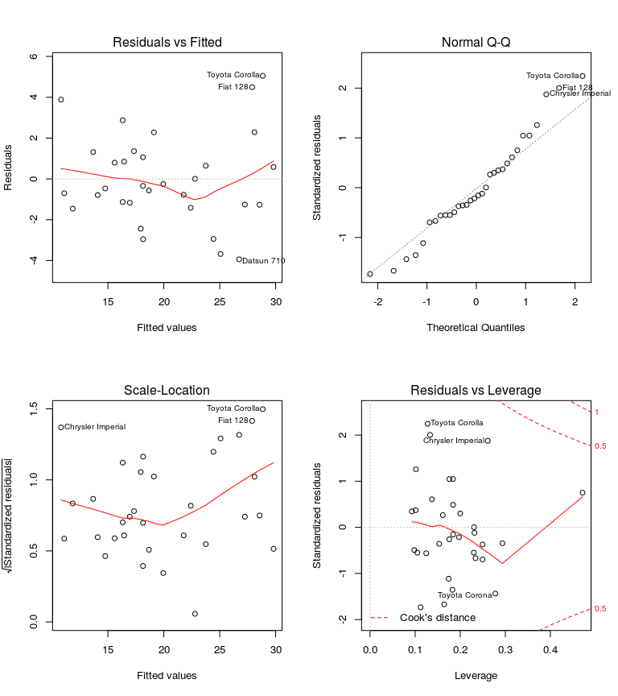

# Motor Trends: Effect of Transmission on Mileage
Glen Greer, January 2016; Coursera - Regression Models  

# Executive Summary

The fact that manual transmission vehicles are more fun to drive is a given, but what is the effect on mileage?  We explore this question in this report using linear regression models.  We show that there are many variables that impact fuel efficiency, and ultimately conclude that manual transmission vehicles are better for MPG getting on average $[1.809]$ `mpg` more than automatic transmission vehicles when all other variables are held constant.

# Exploratory Data Analysis


```r
data(mtcars)
```

The `mtcars` dataset comes from a 1974 Motor Trend magazine.  It contains $[32]$ observations for $[11]$ variables.

5 of the variables are factors, including the transmission type we are interested in: `am`.  We adjust these prior to performing any calculations.


```r
mtcars$am <- factor(mtcars$am, labels=c("Auto","Manual"))
mtcars$carb <- factor(mtcars$carb)
mtcars$cyl <- factor(mtcars$cyl)
mtcars$gear <- factor(mtcars$gear)
mtcars$vs <- factor(mtcars$vs, labels=c("V","S"))
```

Referencing `Figure 1` in the Appendix, we can see these variables and their relationships.  The relationships at the top of the chart with `mpg` as the dependent variable are the ones we are most concerned with in this report.

# Linear Regression Models

To generate our linear model we start with a model containing all $[11]$ variables, and then use a stepwise AIC algorithm which adds and drops variables repeatedly from the model to select a simpler model that describes the observations in a reasonable fashion. 

```r
all_fit <- lm(mpg ~ ., mtcars)
step_fit <- step(all_fit, direction="both")
```

```r
summary(step_fit)
```

```
## 
## Call:
## lm(formula = mpg ~ cyl + hp + wt + am, data = mtcars)
## 
## Residuals:
##     Min      1Q  Median      3Q     Max 
## -3.9387 -1.2560 -0.4013  1.1253  5.0513 
## 
## Coefficients:
##             Estimate Std. Error t value Pr(>|t|)    
## (Intercept) 33.70832    2.60489  12.940 7.73e-13 ***
## cyl6        -3.03134    1.40728  -2.154  0.04068 *  
## cyl8        -2.16368    2.28425  -0.947  0.35225    
## hp          -0.03211    0.01369  -2.345  0.02693 *  
## wt          -2.49683    0.88559  -2.819  0.00908 ** 
## amManual     1.80921    1.39630   1.296  0.20646    
## ---
## Signif. codes:  0 '***' 0.001 '**' 0.01 '*' 0.05 '.' 0.1 ' ' 1
## 
## Residual standard error: 2.41 on 26 degrees of freedom
## Multiple R-squared:  0.8659,	Adjusted R-squared:  0.8401 
## F-statistic: 33.57 on 5 and 26 DF,  p-value: 1.506e-10
```

Looking at `Figure 2` in the Appendix, we can see what relationships the variables in the AIC model have with `mpg`.  This is a reasonably good model describing $84\%$ of the variability in the data based on the adjusted $R^2$ value.  This model also shows that while transmission does have an impact on the estimated `mpg` it is not the most significant variable.

# Residual Diagnostics

We plot the residuals to aid in our diagnosis of them.  See `Figure 3` in the Appendix for the plots.  These residual plots show:

* No systematic pattern in the Residuals vs. Fitted plot
* Residuals normally distributed in the Q-Q plot
* Constant variance in the Scale-Location plot with a random distribution
* No influential outliers (>0.5) in the Residuals vs. Leverage plot

# Conclusion

Our linear model shows that light, 4-cylinder vehicles with lower horsepower and manual transmission generally have better mileage. Specifically, if weight, cylinder count, and horsepower are held constant vehicles with manual transmission will gain on average $[1.809]$ miles per gallon than that of an equivalent vehicle with an automatic transmission.

\pagebreak

# Appendix
## Figure 1 - Pairs Plot for Motor Trends Cars Dataset

```r
pairs(mtcars, panel=panel.smooth)
```

 

\pagebreak

## Figure 2 - MPG vs Cylinders, Horsepower, Weight and Transmission


```r
par(mfrow=c(2,2), mar=c(4,4,1,1))
boxplot(mpg ~ am*cyl, mtcars, col=c("Blue","Red"), xaxt="n", xlab="cyl", ylab="mpg")
axis(1, at=c(1.5,3.5,5.5), labels=c(4,6,8))
plot(mpg ~ hp, mtcars, col="White")
points(mpg ~ hp, mtcars[mtcars$am=="Manual",], col="Blue")
points(mpg ~ hp, mtcars[mtcars$am=="Auto",], col="Red")
plot(mpg ~ wt, mtcars, col="White")
points(mpg ~ wt, mtcars[mtcars$am=="Manual",], col="Blue")
points(mpg ~ wt, mtcars[mtcars$am=="Auto",], col="Red")
plot(mpg ~ am, mtcars, levels=c("Manual","Auto"), col=c("Blue","Red"))
```

 

\pagebreak

## Figure 3 - Residual Plots of AIC Selected Linear Model

```r
par(mfrow=c(2,2))
plot(step_fit)
```

 
